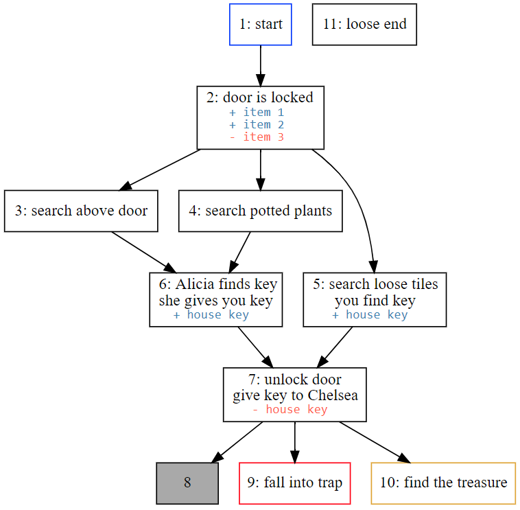
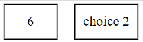
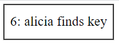
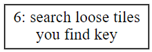
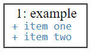
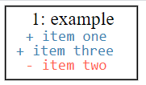
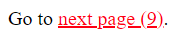

# What is it?

This script is for converting various markdown formats into a single standard markdown file, a dot file for rendering in graphviz, and a directory of epub-ready XHTML files. It was designed to assist in the creation of gamebooks, but it will still be useful for creating epubs in general.

The supported input files for conversion to markdown are TiddlyWiki exported JSON, Twine publshed/archived HTML, Twee script, and Sadako script files. These along with standard markdown files are supported for conversion to graphviz dot files and epub files.

The following is an example of a graphviz flow chart automatically generated from links and settings placed within your story.



##  Example

You can find an example here, with its compiled epub and generated png and svg flowcharts: 

* [example story](example/)


# How do you use it?

This script needs to be run from the command line. The command is run like this:

```
gamebook_markdown.exe file1.tw file2.tw file3.tw -o story -g -e
```

Any number of input files are allowed, with the exception of TiddlyWiki JSON which only allows one. The type of file is taken from the extension of the first input file. Mixed types are not allowed. The files are combined in the order that they are listed.

`-o` or `--output` specifies the project name. Do not use an extension. If the output is `story`, then `story.md` (markdown), `story.dot` (graphviz), and a `story` directory (epub) will be created.

`-g` or `--graphviz` converts the input to graphviz dot files.

`-e` or `--epub` converts the input to epub files.


# Markdown

This converter only supports a small amount of markdown, as the goal of the project was to easily create gamebooks, not complex pages with tables and such. All unsupported markdown can still be used through normal HTML markup. 

Supported scripting formats:

* [TiddlyWiki](https://tiddlywiki.com/)
* [Twine](http://twinery.org/)
* [Tweego](https://www.motoslave.net/tweego/)
* [Sadako](https://github.com/Tayruh/sadako)
* [CommonMark](https://commonmark.org/)

Supported markdown:

```
TiddlyWiki:
//italic//
''bold''
[[link name]]
[[link name|destination]]
! heading 1
!!heading 2
!!! heading 3
!!!! heading 4

Twine/Twee:
[[link name]]
[[link name|destination]]
[[link name->destination]]
[[destination<-link name]]

Sadako:
[:link name:]
[:link name @: destination:]

Markdown:
*italic*
_italic_
**bold**
[link name](#destination)
# heading 1
# heading 2
## heading 3
### heading 4
```

Be aware that links using markdown are assumed to be directing to other sections of markdown. For files outside of markdown (like a website or file), use normal HTML anchor links.

Also note that `!` (heading 1) in TiddlyWiki is converted to `<h1>` for markdown, while the rest are converted from `!!` to `##`. This is because `#` in markdown is used to denote a new section and section name. The sections and section name are stored separately in TiddlyWiki, so it's assigned to `#` during conversion. Therefore you'll have two level 1 headings, with the one that you defined appearing in the epub files.


# Graphviz

## Compiling

Graphviz is an application for creating flowcharts which are useful for seeing your project as a forest instead of the trees. Its input files are .dot files (lightly scripted files), which this converter outputs.

In order to turn these files into an actual flowchart, you'll have to use the compiler located on the official page: [Graphviz Official Site](https://graphviz.org/)

This is a command line application as well. There are multiple styles of formatting your flowchart, and each is a separate app but they all use .dot files. The dot or neato compilers  are the most commonly used. 

A typical command looks like this:

```
dot.exe story.dot -Tpng -o story.png
```

This outputs your flowchart as a .png graphics file which is useful because it's so widely supported. If you need higher graphic fidelity for a fraction of the file size (as you may, once your story gets larger), you can output to SVG instead, which is supported by most modern web browsers.


```
dot.exe story.dot -Tsvg -o story.svg
```


## Configuration

I have added some configuration settings that can be applied to sections of your markdown via the `<!-- -->` comment tags.


### Section Labels

Section names are taken from the "H1" element of markdown, which is defined by a single `#` followed by some text. In other words, this:

```
# 6
This is a section.

# choice 2
This is another section.
```

renders this:



"6" and "choice 2" aren't very descriptive, even though they make for decent section names. To make the flowchart more readable, we can assign labels to the sections. The only purpose of these labels are to enhance the graphviz chart. They have no bearing on epub or anything else. 

The first comment in a section will be the label of the section to be displayed inside the flowchart. 

```
# 6

<!-- alicia finds key -->

Behind you Alicia shouts, "I found it!"
```

This will be rendered like so:



Epub settings (anything beginning with `epub:`) will be ignored, as well as any comment beginning with `!`. For example, the following will render the same as the image above.

```
# 6

<!-- epub:include ["example.jpg"] -->
<!-- !this is ignored -->

Behind you Alicia shouts, "I found it!"

<!-- alicia finds key -->
```

Labels can also have line breaks in them. They can either be with a natural line break or `<br>` or `<br/>`. Whichever suits you best.

These both render the same:

```
# 6
<!-- search loose tiles <br> you find key -->
```
```
# 6
<!-- 
    search loose tiles
    you find key 
-->
```




### Flags

You can list flags, keywords, or items that are added or removed with a section. The flags setting will be ignored as a section name.

To list flags, begin a comment with the word `flags`, then list your flags separated by line breaks. For example:

```
# 1
<!-- example -->
<!-- flags item one<br>item two -->
```

or

```
# 1
<!-- example -->
<!-- flags
	item one
	item two
-->
```

or

```
# 1
<!-- example -->
<!-- flags
	+ item one
	+ item two
-->
```

Which all render like so:



Flags by default (or optionally tagged with `+` for readability) will be displayed in a blue color, and any item listed with `-` will be listed in red. The group of positives will be listed above the negatives.

For example:

```
# 1
<!-- example -->
<!-- flags
	item one
	- item two
	+ item three
-->
```

Renders like this:



The flags will be listed below the section name in the flowchart. 


### Excluding

You can choose not to graph a section (like the title page or the table of contents, etc) by including this setting in the section:

```
<!-- nograph --> 
```


### Section Types

There are three defined section types. They are:

```
<!-- start -->
<!-- good end -->
<!-- bad end -->
```

These count as the section label if no other label is given. These assigned types help readability of the flowchart by assigning a blue border to `start` (the beginning section of your story), a gold border to `good end` (good or true endings), and a red border to `bad end` (bad endings or game overs).

Additionally, any broken links will be displayed as a box with a gray background.


# EPUB

## Compiling

For best results, compilng to epub should be done from the root directory of the markdown. This ensures that including files will find the correct directories.

Converting an epub directory to an .epub file is as simple as zipping the folder and changing the .zip file extension to .epub. In theory, anyway. The one catch is that the `mimetype` file in the root directory must be added *first* and be *uncompressed*. 

To be honest, I'm pretty sure most ebook readers will load the file just fine even without making sure the `mimetype` is first or compressed, but not doing so fails [epubcheck](https://github.com/w3c/epubcheck), so it's better to be safe.

#### GUI Method

This is really easy to do if you're using a GUI archiver. Just add `mimetype` to a new archive, set compression to `none` or `store`, and save. Then drop the two folders into the archive after.

#### Command Line Method

There are probably better options available for the command line in other operating systems, but they're very limited for Windows. Winrar, winzip, and 7zip all add the file uncompressed inside the GUI, but I could not get them to do it on the command line. The best I could find (at the moment) is is this outdated port of `zip`: [gnu32 zip](http://gnuwin32.sourceforge.net/packages/zip.htm).

To use it, run the commands:
```
zip.exe -X0 story.epub "mimetype"
zip.exe -Xr story.epub "META-INF/" "OEBPS/"
```


## Conversion

All input formats are converted to standard markdown before being converted to an epub. This documentation uses standard markdown for its examples, but you can use the markup of your input format for convenience.

During conversion all empty lines are removed and paragraphs are wrapped in `<div>` tags assigned the class `paragraph`.

The `<center>` tag is also changed to `<div style="width: 100%; text-align: center">`, since `<center>` is not allowed in the XHTML specifications.

Some simple markdown is also converted to HTML. Namely bold, italic, heading, and link markup.

Any links to sections that don't exist will be wrapped in a span tag and assigned the class `missing`. They will be also written to display the missing section in parenthesis following the link name. 

```
Go to [next page](#9).
```

Would render like so if it were missing;




## Configuration

Just like with Graphviz conversion, I added some configuration settings via the `<!- -->` comment tags. The only settings that are required for successful epub conversion are `epub:nav` and `epub:meta`.


### Navigation

This is the navigation pane that appears in your ebook reader, not the table of contents that's in your book. This section is required for all epub books. This will be saved as `nav.xhtml` inside your epub directory. 

This setting is required and can only be declared once.

Navigation is defined like this:

```
<!-- epub:nav
    <ol>
        <li>
            [Begin Story](#1)
        </li>
    </ol>
-->
```

As you can see, it's a numbered list using the `<ol>` tag (`<ul>` bullet points throw an error). More information can be found [here](https://www.w3.org/publishing/epub32/epub-packages.html#sec-package-nav-def).


### Metadata Settings

This is the information about your book, like the author, the title, the subject, etc.  This setting is required and can only be declared once.

There are nine definable meta settings, but only two are required: `title` and `identifier`. `language` and `modified` are also required by the epub standards, but the converter assigns `en` as the default and automatically generates and assigns the modified date, so you don't need to worry about those.

```
<!-- epub:meta 
{
    "title": "My Story",
    "identifier": "urn:uuid:A1B0D67E-2E81-4DF5-9E67-A64CBE366809",
    
    "language": "en-US",
    "contributor": "John Smith",
    "creator": ["Tayruh", "Jim Bob"],
    "date": "2000-01-01T00:00:00Z",
    "subject": "Horror, Suspense",
    "description": "This is an epub example.",
    "publisher": "Penguin Inc"
}
-->
```

As you can see, the metadata is defined as a JSON object. If you don't know what that is, you just need to know that it's defined like below: 

```
{
	"setting 1": "value",
	"setting 2": ["value 1", "value 2"]
}
```

`identifier` can just be a gibberish value until you want to publish it to a store. This is where the ISBN goes.

`contributor` and `creator` are the only settings that can take more than one value.

`date` is the publication date, not modified date.

More information can be found [here](https://www.w3.org/publishing/epub32/epub-packages.html#sec-pkg-Metadata).


### CSS

CSS settings are collected from each section that they're defined in and combined into a single CSS file saved as `style.css` in your epub directory.

They're defined like this:

```
<!-- epub:css
    .paragraph {
        margin-top: 1.15em;
        margin-bottom: 1.15em;
    }

    .section-title {
        width: 100%;
        text-align: center;
        font-size: 1.5em;
        margin-bottom: 1em;
    }

	/*  */
    .section:not(:first-of-type) {
        margin-top: 3em;
    }
    
    .missing a, .missing a:visited {
   		color: red;
   	}
-->
```

Classes:

* **paragraph:** Every paraph in a section has this class. Paragraphs are separated by a blank link. A single carriage return inserts a `<br/>`.

* **section-title:** Section names are given this class.

* **section:** The entire section (including the section title) is wrapped in this class.

* **missing:** This class is given to span wrapped around links for missing sections.


### Landmark Types

There are many different types of book sections that you can define. Declaring the type in a section defines that section as that landmark item. 

Declare it like this:

```
<!-- epub:type title-page -->
```

These are your available options:

* cover – the book cover(s), jacket information, etc.
* toc – table of contents
* bodymatter – First "real" page of content (e.g. "Chapter 1")
* title-page – page with possibly title, author, publisher, and other metadata
* frontmatter
* backmatter
* loi – list of illustrations
* lot – list of tables
* preface
* bibliography
* index – back-of-book style index
* glossary
* acknowledgments 

The most important are `cover`, `title-page`,`toc`, and  `bodymatter`. 

You can find more information [here](https://www.w3.org/publishing/epub32/epub-packages.html#sec-nav-landmarks).


### Includes

The epub specs are very particular that any item included in the epub file must be listed in the manifest.

The specs are also very particular about which can be included, which means it's only items that can be rendered inside HTML. Files that are not one of the supported media types will not be included in the epub file. You can find a list of supported types [here](https://www.w3.org/publishing/epub32/epub-spec.html#sec-cmt-supported).

This setting can be called as many times as you want. You don't have to frontload all included files in the first section. You can just include them in the section that you plan on using them in.

Items included will automatically be defined in the manifest and copied to the epub directory. If the included item is a directory instead of a file, all files in that directory will be copied over (retaining directory structure) and added to the manifest. 

Because of how this works, you shouldn't have to worry about your markdown links differing from your epub file links, as long as the links direct to the root directory or a subdirectory of the markdown.

```
<!-- epub:include ["test.jpg"] -->
<!-- epub:include ["styles/stylesheet.css", "media/images"]


```

This above code includes "test.jpg", "stylesheet.css" in the "styles" directory, and all files inside "media/images". Also notice that even single items must be declared as an array (inside quotes and square brackets).


### Cover Image

The cover image is what displays inside your ebook reader's "book shelf" or library navigation. It can be different than the cover page inside your book. This setting can only be declared once.

It's declared like this:

```
<!-- epub:cover images/example.jpg -- >
```

The image will be automatically copied to your epub directory and added to the manifest. Therefore you don't need to include it using `epub:include`.

If the file is inside a directory that's already being included via `epub:include`, it won't be added to the manifest twice, so you don't need to worry about that.


### Titles

Section names are not added to the section text by default. By using the title setting, they will be added to the top of the section inside of a div assigned the `section-title` class.

Begins showing titles:

```
<!-- epub:titles start -->
```

Stops showing titles:

```
<!-- epub:titles stop -->
```

`start`/`stop` are aliases for `begin`/`end`, `true`/`false`, and `on`/`off`.

It's not always convenient to name your section numerically, as a more descriptive section name is sometimes more preferred. Using the `epub:titles` setting you can automatically name them numerically in the output.

Begins showing titles named numerically, starting at 1:

```
<!-- epub:titles start 1 -->
```

Stops showing titles:
```
<!-- epub:titles stop -->
```

Not only will section titles be renamed, but links to sections will also be renamed to match their targets. Occasionally this may be inconvenient. To prevent this behavior for a specific link, begin the link name with a `!`. Like so:

```
[!begin story](#target)
```

or in other markup:

```
[[!begin story|target]]
[[!target]]
```

### Section Labels

Similar to how numbers don't make for great section names, section names like "stat info" isn't a great section title, and "An Explanation of Character Stats" isn't a very convenient section name to link to.

To get around this, you can declare a name that is only for labeling a section. This will be displayed inside of the div that links direct to instead of the section name like normal. The one exception to this is that if `epub:titles` is given a numeric value for automatic naming, the assigned will be used instead of the label or section name.

Section names are defined as such:

```
# test

<!-- epub:label This is a "test" title. -->
```


### Collections

By default sections are assigned their own page. This is ideal for stories where each section is a chapter, but less than an ideal for a gamebook where a section might only be a few sentences long, especially if you intend to go to print.

Using the `epub:collection` setting you can collect a block of sections into a single page.

Begins collecting sections:

```
<!-- epub:collection start -->
```

Stops collecting sections:

```
<!-- epub:collection stop -->
```

<<<<<<< HEAD
=======
`start`/`stop` are aliases for `begin`/`end`, `true`/`false`, and `on`/`off`.

Be aware that links to sections within a page collection will not work correctly unless titles are displayed, as it will not have a div with an ID to jump to. You'll either need to enable titles via `epub:titles` or use the `epub:label` setting for that section.
>>>>>>> b66c56b7b80f511f5580a979b9c1bcf37becbf64

### Shuffle

A gamebook is no good if all sections are placed in a readable order, which is destined to happen as your story is written. The `epub:shuffle` setting rearranges the sections in your story. If `epub:titles` is used, the section will still be numerically titled in ascending order and the link names renamed and targeting the correct passages.

Begins shuffling sections:

```
<!-- epub:shuffle start -->
```

Stops collecting sections:

```
<!-- epub:shuffle stop -->
```

<<<<<<< HEAD
Be sure to avoid changing the `epub:title` settings during shuffling as it'll have unpredicable results.


### Fixed Sections

Sometimes within shuffled blocks of sections you want a few sections with hardcoded section names and locations. 

A good example of this requirement are gamebooks that include puzzles which ask you to turn a section based on a solution. For example:

> What animal meows? If you think you know the answer, add the letters together (where A=1, B=2, C=3, etc) and turn to that section.

In this case, the answer is 24 (3+1+20=24) so you would want the section 24 to be fixed in place so that you can have the reader turn to it when they guess the correct answer.

To fix the section in place as section 24, just add an `epub:fixed` setting to the section along with the section number that you wish to have it fixed to.

```
<!-- epub:fixed 24 -->
```

There are also situations in gamebooks where the puzzle involves doing something on a certain section. In this instance, the solution relies on the section that contains the puzzle. For example, let's say you have a section that tells you: 

> You have found a key. If you come across a door that you think can be unlocked with the key, add 50 to the section number and turn to that section.

If there is a locked door on section 30, the player can use their previous knowledge of how to use the key and turn to section 80 to unlock it.

This is all well and good, but it now relies on both the section with the door and the section with unlocking to be fixed. The puzzle with break if either of the sections move. To get around this, we can use a section name as an ancor.

```
# locked door
<-- epub:fixed 30 -->

There is a locked door here.


# unlock the door
<!-- epub:fixed locked door + 50 -->

You unlocked the door!
```

Subtraction also works. You can also refer to a fixed section in which its fixed achor references another fixed section.

```
# A
<!-- epub:fixed C - 20 -->

# C
<!-- epub:fixed 30 -->

# B
<!-- epub:fixed A + 10 -->
```

This will put sections A, B, and C at 10, 20, and 30. As you can see, you reference sections that haven't been defined yet.

There are a few things to be aware of when using fixed sections.

* Don't include `-` or `+` in the section names that you intend to refer to as an anchor.

* A section that anchors to another section (`test + 2`, for example) *must* be fixed. This is to avoid situations where shuffling will put a section out of bounds or in conflict with another section.

* You can't fix a section outside of titled blocks (it wouldn't even make sense), and it won't be fixed if the titled blocks aren't renamed. In other words, if it's displaying the section name or label instead of the ordered section number, just disable shuffling to fix it in place. You won't be able to refer to it as an fixed anchor, however.

* You can't set a fixed value tp a value outside of the current shuffled block. You also can't refer to a fixed anchor outside of the current shuffled block. For example, this will fail:
	```
	# A
	<!-- epub:titles start 1 -->
	<!-- epub:shuffle start -->

	# B
	<!-- epub:fixed 5 -->
	This fails because it can only be values 1 through 3 for 
	this shuffle block.
	
	# C
	<!-- epub:shuffle end -->
	
	# D
	<!-- epub:shuffle start -->
	
	# E
	<!-- epub:fixed B + 3 -->
	This fails because this shuffled block only 
	includes D and E, not B.
	```
=======
`start`/`stop` are aliases for `begin`/`end`, `true`/`false`, and `on`/`off`.
>>>>>>> b66c56b7b80f511f5580a979b9c1bcf37becbf64
